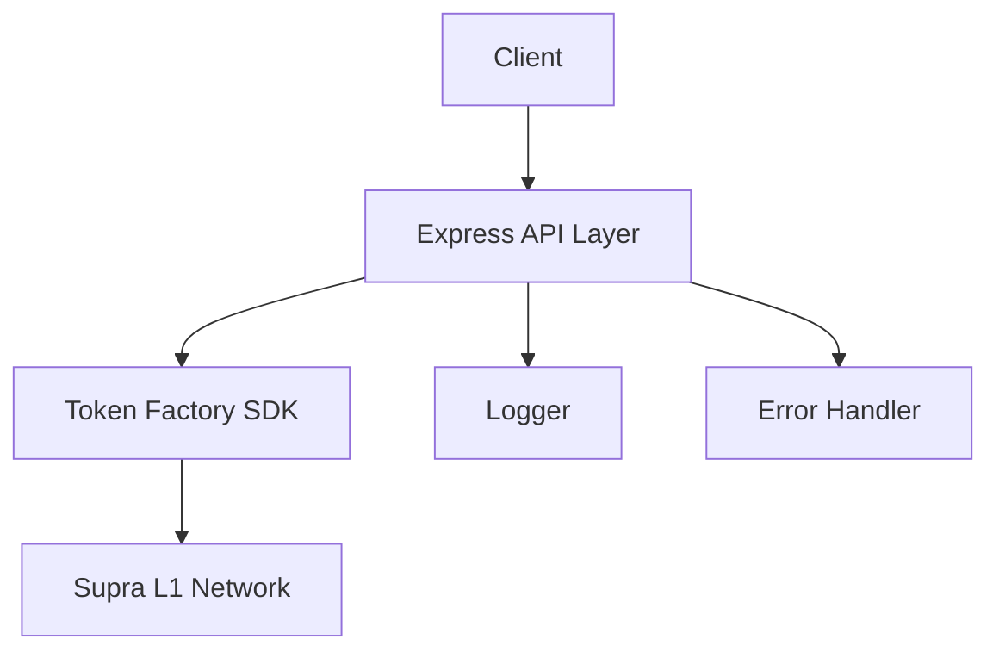
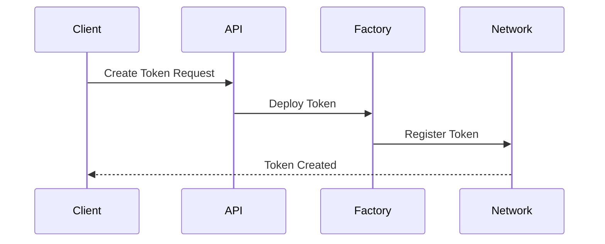
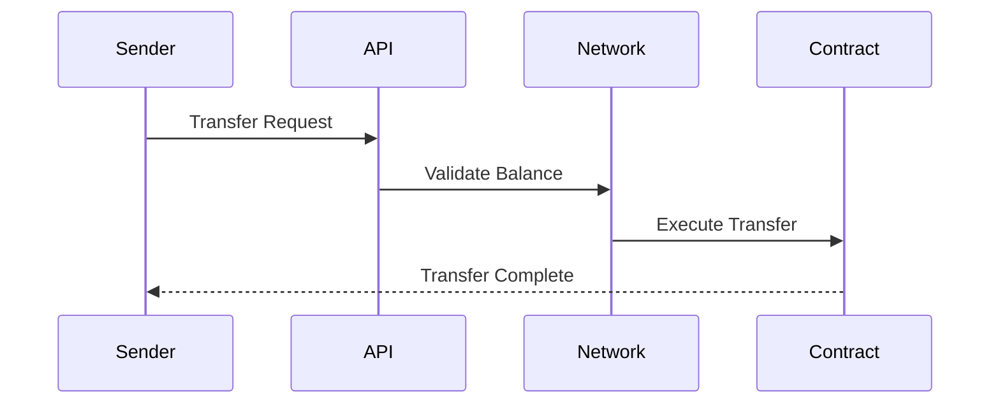

# Supra Token Factory SDK

A TypeScript-based SDK for creating, managing, and interacting with custom tokens on the Supra L1 network.

 [Create diagram showing token factory architecture]

## 🚀 Features

- ✨ Create custom tokens
- 🔄 Transfer tokens between accounts
- 📊 Check token balances
- 🎯 Register for token types
- 🎁 Claim token airdrops
- 🔧 Initialize token factory contracts

## 📋 Prerequisites

- Node.js >= 14
- npm or yarn
- Supra L1 account with SUPRA tokens for gas

## 🛠 Installation 

bash
git clone <repository-url>
cd supra-token-factory
npm install

## 🔧 Configuration

Create a `.env` file:
env
SUPRA_RPC_URL=https://rpc-testnet.supra.com
PORT=5050
LOG_LEVEL=debug

## 📚 API Reference

### Create Token

typescript:README.md
POST /api/tokens/create
{
"tokenOwnerPrivateKey": "YOUR_PRIVATE_KEY",
"name": "MyToken",
"symbol": "MTK",
"tokenType": "1"
}

### Transfer Token

```typescript
POST /api/tokens/transfer
{
    "privateKey": "SENDER_PRIVATE_KEY",
    "tokenType": "1",
    "recipient": "RECIPIENT_ADDRESS",
    "amount": 1000
}
```

### Check Balance

```typescript
GET /api/tokens/balance/:tokenType/:address
```

### Register for Token

```typescript
GET /api/tokens/register/:tokenType?privateKey=USER_PRIVATE_KEY
```

### Claim Token

```typescript
POST /api/tokens/claim
{
    "userPrivateKey": "USER_PRIVATE_KEY",
    "tokenType": "1"
}
```

## 🏗 Architecture



## 🔍 Core Components

1. **Token Factory SDK** (`src/services/token_factory_sdk.ts`)
   - Token creation
   - Transfer functionality
   - Balance checking
   - Registration handling

2. **API Routes** (`src/api/routes/`)
   - RESTful endpoints
   - Request validation
   - Error handling

3. **Constants** (`src/constants/`)
   - Network configurations
   - Contract addresses
   - Default values

## 🔐 Security

- Private key handling
- Transaction validation
- Rate limiting (TODO)
- Input sanitization

## 🧪 Testing

```bash
npm run test
```

## 📈 Transaction Flow

1. **Token Creation**



2. **Token Transfer**



## 🤝 Contributing

1. Fork the repository
2. Create feature branch
3. Commit changes
4. Push to branch
5. Create Pull Request

## 📝 License

MIT

## 🙏 Acknowledgments

- Supra L1 Team
- Move VM Documentation
- Aptos Core Team

## 🔗 Links

- [Supra Documentation](https://docs.supra.com)
- [Move VM Docs](https://move-language.github.io/move/)
- [TypeScript SDK](https://www.npmjs.com/package/supra-l1-sdk)
```

</rewritten_file>
